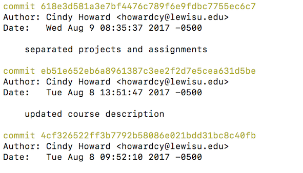

# Getting Started with GitHub

## Version control
Version control is the management of changes to a document over time. It often refers to source code but it can also be used for other documents. Team work increases the complexity of version control since multiple people will be making changes to documents.

## Repositories
Repositories are centralized data stores.  A repository holds the authoritative source documents and tracks historical versions.  Repositories are often client/server where a number of clients can connect to the repository to read/write files.  Repositories may be distributed where each client has a local copy of the entire repository.

## What are Git and GitHub?
[Git](https://git-scm.com) is a distributed version control system that is widely used in software development.  [GitHub](https://github.com) is a repository for projects that use Git for version control.  It also has additional features such as issue management and project management tools.

## Installing Git
You can use [these instructions](https://git-scm.com/book/en/v2/Getting-Started-Installing-Git) to install Git on your laptop.  If you are using Windows, Dr. Klump has written a helpful [article](http://www.lewisu.edu/experts/wordpress/index.php/compsci-how2-using-git-and-github-to-manage-your-code/) on how to install Git on your computer.  In the following exercises, you will walk through using Git and GitHub at the command line on your computer.  Please note that you will not receive credit for this assignment if you upload files to GitHub or edit files directly in GitHub.  You must install Git and push changes from your computer.

## Working Locally
When you develop software, you often write and test code locally and then push it to the repository.  To do that you will need to clone the repository.  First, copy the repository url from GitHub.  Then,  open your Git command line (or terminal on Mac).  Navigate to the directory where you'd like to clone the repository and type the following command:

```
git clone repository-url
```
### Exercise 1
Install Git and clone this repository to your computer.

## Markdown Files
GitHub makes use of [Markdown](https://daringfireball.net/projects/markdown/) for formatting text.  The document that you are reading is written in Markdown. In this assignment and the next, you will use Markdown to prepare your assignments. Markdown files are edited using a text editor.  Some editors that you can use are [Notepad++](https://notepad-plus-plus.org) (Windows), BBEdit (Mac) or [Atom](https://atom.io) (both Windows and Mac).  I find Atom particular useful since it has a package that allows you preview Markdown as you type.  Here is a reference to [Markdown syntax on GitHub](https://guides.github.com/features/mastering-markdown/) .

### Exercise 2
Using a text editor add your name and expected graduation date to the information.md file.  Then push the changes to GitHub using the following commands.  Be sure that you have moved to the repository directory using `cd directory-name` before you issue these commands.

```
git add .
git commit -m "added personal information"
git push origin master
```
## Single Developer Workflow
The commands above are the important ones you need for using GitHub.  The first command `git add .` stages all of your changes but does not commit them.  The next command actually commits your changes.  A commit is like a snapshot of your project at a particular point in time.  The third command pushes your changes to the GitHub repository.  You will be pushing the master branch (more on branching later) to a remote repository. By default the repository that you've cloned will be the origin.  You can see the remote URLS by typing `git remote -v` at the command line.

When working on a single-developer project, you will follow the following steps.
1.  Create a repository on GitHub and clone it to your computer or create a Git repository using the command `git init`.  This will turn the current directory into a Git repository.  Note that you do not need a remote repository to use Git.
1. Add code and other documents.  When you reach a point that you'd like to save, use the commands above to stage, commit and push your changes.

### Exercise 3
Add a new Markdown file and add some content to it.  Make that your file contains at a minimum a header, some code, a list and a link.  Stage and commit the changes and push to GitHub.

## Reviewing commits and reverting to a previous version
To review the commits that you made, type `git log`.  

Sometimes, you will want to discard changes from the last commit or even further back.  The git revert command lets you do this. It doesn't remove the commit from the project history but appends a new commit with the previous content. This prevents Git from losing history.  For example, here is a section of a log from one of my repositories:


To revert to the commit with the message "updated course description", I would type the following command.
```
git revert eb51e652eb6a8961387c3ee2f2d7e5cea631d5be
```

## More Information
To learn more about the Git and GitHub, see the following resources:
* [Git Reference Manual](https://git-scm.com/doc)
* [GitHub Help](https://help.github.com)
* [Git Cheat Sheet](https://services.github.com/on-demand/downloads/github-git-cheat-sheet/)
* [GitHub Bootcamp](https://help.github.com/categories/bootcamp/)
