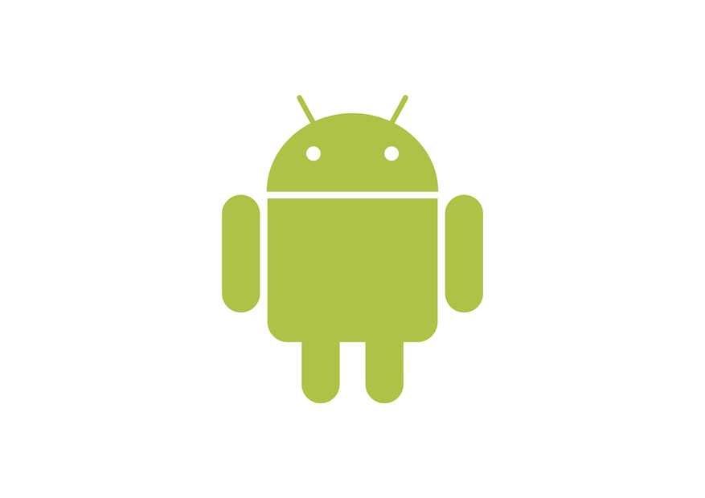

# Mobile Application Development

## Lewis University

## CPSC-41700

##  Android Overview
- Linux based operating system for mobile devices
- Developed by the Open Handset Alliance
  - http://www.openhandsetalliance.com/
  - Led by Google
- Most popular smartphone OS in the U.S.
- More than 1 million devices activated each day worldwide

## Different platforms
- Handsets
- Tablets
- Auto
- TV

## Architecture
https://developer.android.com/guide/platform/index.html
- Kernel based on the Linux kernel
- Middleware, libraries and APIs written in C and application software
- Application framework which includes Java-compatible libraries

## Security Sandbox
- Each Android application lives in its own security sandbox
- Android is a multi-user Linux system in which each application is a different user.
- The system assigns each application a unique Linux user ID
- The system sets permissions for all the files in an application
- Only processes with the appropriate ID can access the file
- Each process has its own virtual machine
- Code is isolated
- Every application runs in its own Linux process

## Application Components
Every application is composed of one or more of the following application components
- Service
- Broadcast Receiver
- Content Provider
- Activity
    

## Distributing Applications
- Google Play Store
- Applications can be purchased and downloaded from the [Google Play Store](
https://play.google.com/store)
- To publish software in the Google Play Store, you must do three things:
  - Register
  - Pay a fee ($25)
  - Agree to the Android Market Developer Distribution Agreement

---
## Object Oriented Programming

### Classes
- Classes are blueprints that represent objects
- Must instantiate the object to use it
- Classes encapsulate
  - Object attributes (instance variables)
  - Object behaviors (methods)
    - Methods tell an object to perform a task

### Inheritance
- Create new objects by extending an existing object
- Add new attributes
- Add new methods
- Override existing methods

---
## Android Studio
- Development environment for Android
- [Download Android Studio](https://developer.android.com/studio/index.html)
- Android Studio walks you through the installation process
- [Android Studio Overview](http://developer.android.com/tools/studio/index.html)

### Create the Pizza Party App
- From Android Studio's welcome screen, click "Start a new Android Studio project".
- From the "Choose your project" screen, select Empty Activity from the Phone and Tablet tab and press Next.
- From the "Configure your project" screen, enter Name: Pizza Party and Package name: `edu.lewisu.example.pizzaparty`.
- Choose Language: Java.
- Leave the minimum API level defaults.
- Note the save location where Android Studio will create the project and press Finish.

## Android Emulators
- Android Virtual Device (AVD)
- Allow you to run Android apps in a simulated environment
  - To run an app you must have an AVD or use an Android device

### Defining an AVD
- Select Tools-Android-AVD Manager Or select AVD manager from the toolbar
- Create a Pixel 4 with Google Play Store

### HAXM
- You may need to install a hardware accelerator in order to get the emulator to run.
- Can install using Android Studio but you may need to run an installation program
- Requires an Intel processor
- Additional instructions
  - [Intel/HAXM](https://github.com/intel/haxm)

## Building and Running Applications
- Android SDK tools compile the code and any data and resource file into an Android package
- An archive file with an .apk suffix.
- All the code in an Android package is considered to be one application
- Android devices use  the .apk file to install the application
- Build process diagram in the zyBook

## Running an Android App
- Select Run from the menu and then Run 'app' Or click Run from the toolbar
